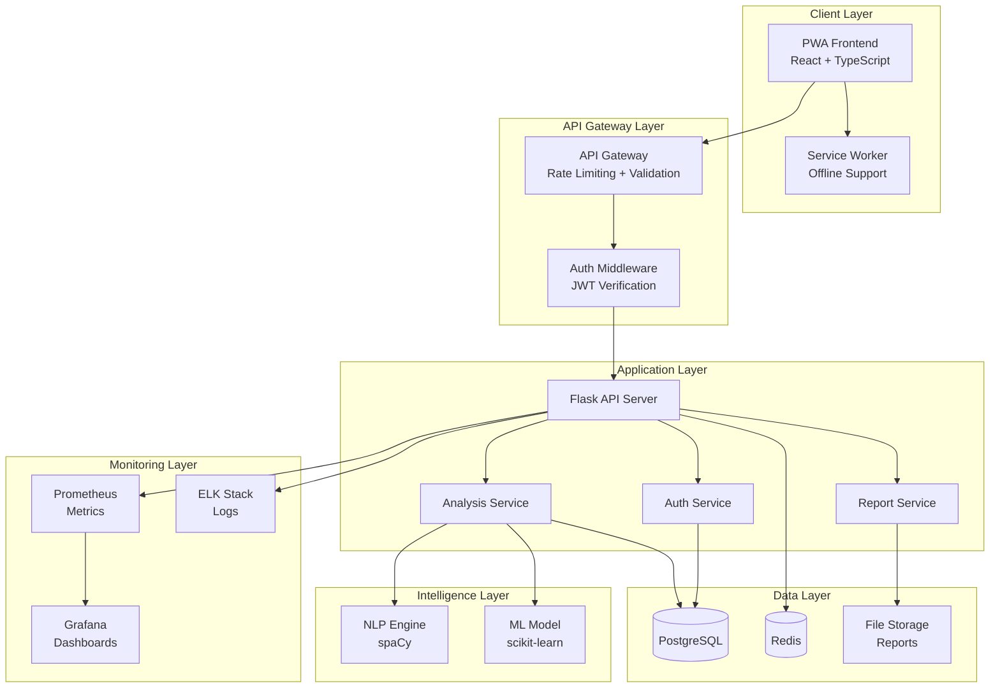
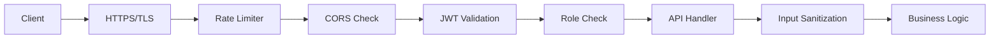
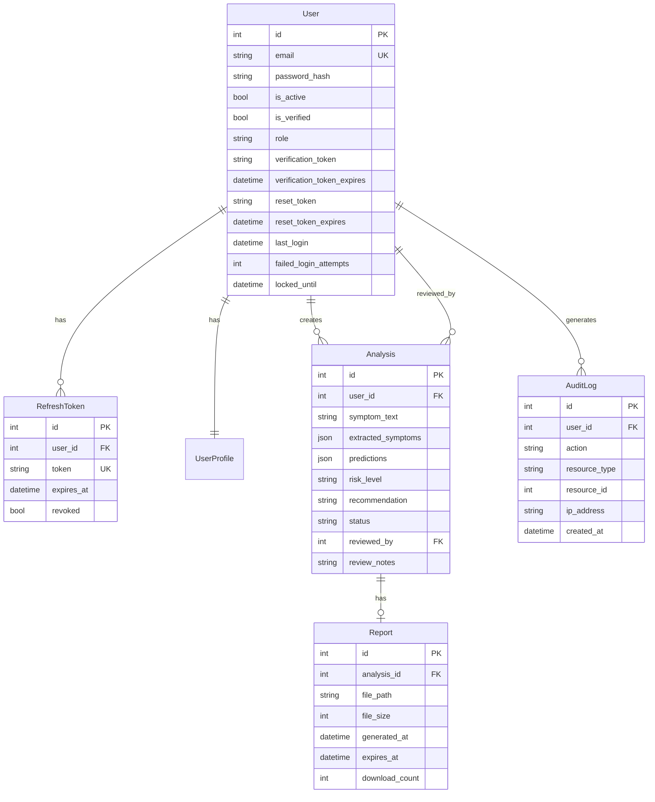
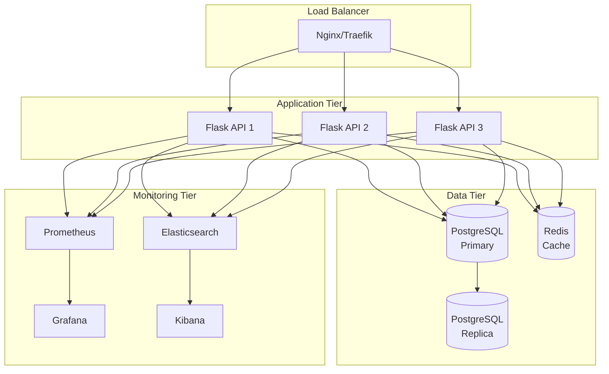

# Design Document: Medical Diagnosis Enhancement

## Overview

This design transforms the existing medical diagnosis application into an industry-ready system with enterprise-grade features. The architecture follows a microservices-inspired approach with clear separation of concerns, comprehensive security, and production-ready infrastructure.

The system consists of:
- **Backend API**: Flask-based REST API with JWT authentication, role-based access control, and comprehensive security features
- **Frontend SPA**: React/TypeScript application with Material-UI, PWA capabilities, and offline support
- **NLP Engine**: spaCy-based service for symptom extraction and intelligent autocomplete
- **ML Service**: scikit-learn model for disease prediction and risk assessment
- **Infrastructure**: Docker containers, PostgreSQL database, Redis cache, monitoring stack (Prometheus, Grafana, ELK)

## Architecture

### High-Level Architecture



### Component Architecture

The system is organized into distinct layers with clear responsibilities:

1. **Client Layer**: Progressive Web Application with offline capabilities
2. **Gateway Layer**: Request validation, rate limiting, security headers
3. **Application Layer**: Business logic and service orchestration
4. **Intelligence Layer**: NLP and ML processing
5. **Data Layer**: Persistent storage and caching
6. **Monitoring Layer**: Observability and alerting

### Security Architecture



## Components and Interfaces

### 1. Authentication Service

**Responsibilities:**
- User registration with email verification
- Login with JWT token generation
- Token refresh mechanism
- Password reset flow
- Account verification
- Session management

**Interface:**
```python
class AuthService:
    @staticmethod
    def register_user(email: str, password: str, profile_data: dict, role: str = 'patient') -> Tuple[User, str]:
        """Register a new user and send verification email."""
        
    @staticmethod
    def authenticate_user(email: str, password: str) -> Tuple[dict, User]:
        """Authenticate user and return JWT tokens."""
        
    @staticmethod
    def refresh_access_token(refresh_token: str) -> dict:
        """Generate new access token from refresh token."""
        
    @staticmethod
    def request_password_reset(email: str) -> str:
        """Generate password reset token and send email."""
        
    @staticmethod
    def reset_password(token: str, new_password: str) -> bool:
        """Reset password using valid token."""
        
    @staticmethod
    def verify_email(token: str) -> bool:
        """Verify user email with verification token."""
        
    @staticmethod
    def logout(refresh_token: str) -> bool:
        """Invalidate refresh token."""
```

**Token Structure:**
- Access Token: Short-lived (15 minutes), contains user_id, role, email
- Refresh Token: Long-lived (30 days), stored in database with expiry
- Reset Token: Time-limited (1 hour), single-use, stored with user
- Verification Token: Time-limited (24 hours), single-use

### 2. API Gateway Middleware

**Responsibilities:**
- Rate limiting per user/IP
- Request validation against schemas
- Security header injection
- Request/response logging
- Error handling and formatting

**Interface:**
```python
class APIGateway:
    def __init__(self, app: Flask):
        self.rate_limiter = Limiter(app, key_func=get_user_or_ip)
        self.validator = RequestValidator()
        
    def apply_rate_limit(self, limit: str):
        """Decorator for rate limiting endpoints."""
        
    def validate_request(self, schema: Schema):
        """Decorator for request validation."""
        
    def add_security_headers(self, response: Response) -> Response:
        """Add security headers to response."""
        
    def handle_error(self, error: Exception) -> Response:
        """Format error responses consistently."""
```

**Rate Limits:**
- Anonymous users: 100 requests/hour
- Authenticated users: 1000 requests/hour
- Login endpoint: 5 requests/minute
- Register endpoint: 3 requests/hour
- Password reset: 3 requests/hour

**Security Headers:**
```python
SECURITY_HEADERS = {
    'Strict-Transport-Security': 'max-age=31536000; includeSubDomains',
    'X-Content-Type-Options': 'nosniff',
    'X-Frame-Options': 'DENY',
    'X-XSS-Protection': '1; mode=block',
    'Content-Security-Policy': "default-src 'self'; script-src 'self' 'unsafe-inline'; style-src 'self' 'unsafe-inline'",
    'Referrer-Policy': 'strict-origin-when-cross-origin'
}
```

### 3. NLP Engine

**Responsibilities:**
- Extract medical entities from natural language
- Provide autocomplete suggestions
- Normalize symptom terms
- Handle typos and abbreviations

**Interface:**
```python
class NLPEngine:
    def __init__(self, model_name: str = 'en_core_web_sm'):
        self.nlp = spacy.load(model_name)
        self.medical_vocab = self._load_medical_vocabulary()
        
    def extract_symptoms(self, text: str) -> List[str]:
        """Extract symptom entities from text."""
        
    def autocomplete(self, partial_text: str, limit: int = 10) -> List[dict]:
        """Provide autocomplete suggestions."""
        
    def normalize_symptom(self, symptom: str) -> str:
        """Normalize symptom to ML model vocabulary."""
        
    def expand_abbreviation(self, abbr: str) -> str:
        """Expand medical abbreviation to full term."""
```

**Autocomplete Response:**
```python
{
    "suggestions": [
        {
            "text": "headache",
            "score": 0.95,
            "category": "symptom"
        },
        {
            "text": "head injury",
            "score": 0.87,
            "category": "condition"
        }
    ]
}
```

### 4. ML Prediction Service

**Responsibilities:**
- Load and manage ML models
- Generate disease predictions
- Calculate risk assessments
- Provide confidence scores

**Interface:**
```python
class MLPredictionService:
    def __init__(self, model_path: str, vectorizer_path: str, symptom_columns_path: str):
        self.model = self._load_model(model_path)
        self.vectorizer = self._load_vectorizer(vectorizer_path)
        self.symptom_columns = self._load_symptom_columns(symptom_columns_path)
        
    def predict(self, symptoms: List[str]) -> List[dict]:
        """Predict diseases from symptoms."""
        
    def calculate_risk(self, predictions: List[dict]) -> str:
        """Calculate risk level (low, medium, high)."""
        
    def reload_model(self, model_path: str) -> bool:
        """Hot-reload ML model without downtime."""
```

**Prediction Response:**
```python
{
    "predictions": [
        {
            "disease": "Common Cold",
            "confidence": 0.87,
            "probability": 0.87
        },
        {
            "disease": "Influenza",
            "confidence": 0.72,
            "probability": 0.72
        }
    ],
    "risk_level": "medium",
    "recommendation": "Monitor symptoms. Consult doctor if symptoms worsen."
}
```

### 5. Analysis Service

**Responsibilities:**
- Orchestrate symptom analysis workflow
- Store analysis results
- Retrieve analysis history
- Generate analysis summaries

**Interface:**
```python
class AnalysisService:
    def __init__(self, nlp_engine: NLPEngine, ml_service: MLPredictionService):
        self.nlp = nlp_engine
        self.ml = ml_service
        
    def create_analysis(self, user_id: int, symptom_text: str) -> Analysis:
        """Create new analysis from symptom text."""
        
    def get_analysis(self, analysis_id: int, user_id: int) -> Analysis:
        """Retrieve analysis by ID."""
        
    def get_user_analyses(self, user_id: int, limit: int = 10) -> List[Analysis]:
        """Get user's analysis history."""
        
    def update_analysis(self, analysis_id: int, user_id: int, data: dict) -> Analysis:
        """Update existing analysis."""
```

### 6. Report Generation Service

**Responsibilities:**
- Generate PDF reports from analyses
- Store reports with expiry
- Clean up expired reports
- Track report downloads

**Interface:**
```python
class ReportService:
    def __init__(self, storage_path: str, expiry_days: int = 30):
        self.storage_path = storage_path
        self.expiry_days = expiry_days
        
    def generate_report(self, analysis: Analysis) -> str:
        """Generate PDF report and return file path."""
        
    def get_report(self, report_id: int, user_id: int) -> bytes:
        """Retrieve report file."""
        
    def cleanup_expired_reports(self) -> int:
        """Delete expired reports and return count."""
        
    def log_download(self, report_id: int, user_id: int) -> None:
        """Log report download event."""
```

### 7. Email Service

**Responsibilities:**
- Send verification emails
- Send password reset emails
- Send notification emails
- Retry failed sends

**Interface:**
```python
class EmailService:
    def __init__(self, smtp_config: dict):
        self.smtp_config = smtp_config
        self.templates = self._load_templates()
        
    def send_verification_email(self, user: User, token: str) -> bool:
        """Send account verification email."""
        
    def send_password_reset_email(self, user: User, token: str) -> bool:
        """Send password reset email."""
        
    def send_notification(self, user: User, subject: str, body: str) -> bool:
        """Send generic notification email."""
        
    def _send_with_retry(self, to: str, subject: str, html: str, max_retries: int = 3) -> bool:
        """Send email with retry logic."""
```

### 8. Cache Service

**Responsibilities:**
- Cache frequently accessed data
- Invalidate stale cache entries
- Handle cache misses gracefully
- Provide cache statistics

**Interface:**
```python
class CacheService:
    def __init__(self, redis_url: str):
        self.redis = redis.from_url(redis_url)
        
    def get(self, key: str) -> Optional[Any]:
        """Get value from cache."""
        
    def set(self, key: str, value: Any, ttl: int) -> bool:
        """Set value in cache with TTL."""
        
    def delete(self, key: str) -> bool:
        """Delete key from cache."""
        
    def invalidate_pattern(self, pattern: str) -> int:
        """Invalidate all keys matching pattern."""
        
    def get_stats(self) -> dict:
        """Get cache statistics."""
```

**Cache Keys:**
```python
CACHE_KEYS = {
    'autocomplete': 'nlp:autocomplete:{query}',  # TTL: 1 hour
    'prediction': 'ml:prediction:{symptom_hash}',  # TTL: 24 hours
    'user_profile': 'user:profile:{user_id}',  # TTL: 15 minutes
    'analysis': 'analysis:{analysis_id}',  # TTL: 5 minutes
}
```

### 9. Monitoring Service

**Responsibilities:**
- Collect application metrics
- Expose Prometheus metrics endpoint
- Track custom business metrics
- Provide health check endpoints

**Interface:**
```python
class MonitoringService:
    def __init__(self):
        self.request_counter = Counter('http_requests_total', 'Total HTTP requests', ['method', 'endpoint', 'status'])
        self.request_duration = Histogram('http_request_duration_seconds', 'HTTP request duration')
        self.db_pool_gauge = Gauge('db_connection_pool_size', 'Database connection pool size')
        self.cache_hit_counter = Counter('cache_hits_total', 'Cache hits', ['key_type'])
        
    def record_request(self, method: str, endpoint: str, status: int, duration: float):
        """Record HTTP request metrics."""
        
    def record_cache_hit(self, key_type: str, hit: bool):
        """Record cache hit/miss."""
        
    def record_db_pool_size(self, size: int):
        """Record database pool size."""
        
    def get_health(self) -> dict:
        """Get service health status."""
```

## Data Models

### User Model (Enhanced)

```python
class User(BaseModel):
    __tablename__ = 'users'
    
    id: int  # Primary key
    email: str  # Unique, indexed
    password_hash: str  # bcrypt hash
    is_active: bool  # Account status
    is_verified: bool  # Email verification status
    role: str  # patient, doctor, admin
    verification_token: Optional[str]  # Email verification token
    verification_token_expires: Optional[datetime]
    reset_token: Optional[str]  # Password reset token
    reset_token_expires: Optional[datetime]
    last_login: Optional[datetime]
    failed_login_attempts: int  # For account lockout
    locked_until: Optional[datetime]
    created_at: datetime
    updated_at: datetime
    
    # Relationships
    profile: UserProfile
    analyses: List[Analysis]
    refresh_tokens: List[RefreshToken]
```

### RefreshToken Model (New)

```python
class RefreshToken(BaseModel):
    __tablename__ = 'refresh_tokens'
    
    id: int
    user_id: int  # Foreign key to users
    token: str  # Unique, indexed
    expires_at: datetime
    revoked: bool  # For logout
    created_at: datetime
    
    # Relationships
    user: User
```

### Analysis Model (Enhanced)

```python
class Analysis(BaseModel):
    __tablename__ = 'analyses'
    
    id: int
    user_id: int  # Foreign key to users
    symptom_text: str  # Original symptom description
    extracted_symptoms: JSON  # NLP extracted symptoms
    predictions: JSON  # ML predictions with confidence
    risk_level: str  # low, medium, high
    recommendation: str  # Generated recommendation
    status: str  # pending, completed, reviewed
    reviewed_by: Optional[int]  # Doctor user_id
    review_notes: Optional[str]
    created_at: datetime
    updated_at: datetime
    
    # Relationships
    user: User
    report: Optional[Report]
```

### Report Model (Enhanced)

```python
class Report(BaseModel):
    __tablename__ = 'reports'
    
    id: int
    analysis_id: int  # Foreign key to analyses
    file_path: str  # Path to PDF file
    file_size: int  # File size in bytes
    generated_at: datetime
    expires_at: datetime  # Auto-delete after 30 days
    download_count: int
    last_downloaded_at: Optional[datetime]
    
    # Relationships
    analysis: Analysis
```

### AuditLog Model (New)

```python
class AuditLog(BaseModel):
    __tablename__ = 'audit_logs'
    
    id: int
    user_id: Optional[int]  # Null for anonymous actions
    action: str  # login, logout, create_analysis, etc.
    resource_type: str  # user, analysis, report
    resource_id: Optional[int]
    ip_address: str
    user_agent: str
    status: str  # success, failure
    error_message: Optional[str]
    created_at: datetime
    
    # Indexes
    __table_args__ = (
        Index('idx_audit_user_action', 'user_id', 'action'),
        Index('idx_audit_created', 'created_at'),
    )
```

### Database Schema Diagram



## Frontend Architecture

### Component Structure

```
src/
├── components/
│   ├── common/
│   │   ├── Button.tsx
│   │   ├── Input.tsx
│   │   ├── Card.tsx
│   │   ├── Loading.tsx
│   │   ├── ErrorBoundary.tsx
│   │   └── OfflineIndicator.tsx
│   ├── auth/
│   │   ├── LoginForm.tsx
│   │   ├── RegisterForm.tsx
│   │   ├── PasswordResetForm.tsx
│   │   └── VerifyEmail.tsx
│   ├── analysis/
│   │   ├── SymptomInput.tsx
│   │   ├── SymptomAutocomplete.tsx
│   │   ├── PredictionResults.tsx
│   │   ├── RiskIndicator.tsx
│   │   └── AnalysisHistory.tsx
│   ├── report/
│   │   ├── ReportViewer.tsx
│   │   └── ReportDownload.tsx
│   └── layout/
│       ├── Header.tsx
│       ├── Sidebar.tsx
│       ├── Footer.tsx
│       └── Layout.tsx
├── pages/
│   ├── HomePage.tsx
│   ├── LoginPage.tsx
│   ├── RegisterPage.tsx
│   ├── DashboardPage.tsx
│   ├── AnalysisPage.tsx
│   ├── HistoryPage.tsx
│   └── ProfilePage.tsx
├── contexts/
│   ├── AuthContext.tsx
│   ├── ThemeContext.tsx
│   └── OfflineContext.tsx
├── hooks/
│   ├── useAuth.ts
│   ├── useApi.ts
│   ├── useOffline.ts
│   └── useNotifications.ts
├── services/
│   ├── api.ts
│   ├── auth.ts
│   ├── storage.ts
│   └── serviceWorker.ts
├── utils/
│   ├── validation.ts
│   ├── formatting.ts
│   └── constants.ts
└── types/
    ├── user.ts
    ├── analysis.ts
    └── api.ts
```

### State Management

Using React Context API for global state:

```typescript
// AuthContext
interface AuthContextType {
    user: User | null;
    accessToken: string | null;
    login: (email: string, password: string) => Promise<void>;
    logout: () => Promise<void>;
    register: (data: RegisterData) => Promise<void>;
    refreshToken: () => Promise<void>;
    isAuthenticated: boolean;
    isLoading: boolean;
}

// OfflineContext
interface OfflineContextType {
    isOnline: boolean;
    queuedRequests: QueuedRequest[];
    addToQueue: (request: QueuedRequest) => void;
    processQueue: () => Promise<void>;
}
```

### PWA Configuration

```typescript
// Service Worker Strategy
const CACHE_NAME = 'medical-diagnosis-v1';
const STATIC_CACHE = [
    '/',
    '/index.html',
    '/static/js/main.js',
    '/static/css/main.css',
    '/manifest.json'
];

// Cache strategies
const strategies = {
    static: 'cache-first',  // JS, CSS, images
    api: 'network-first',   // API calls
    analysis: 'cache-then-network'  // Analysis data
};

// Push notification handling
self.addEventListener('push', (event) => {
    const data = event.data.json();
    self.registration.showNotification(data.title, {
        body: data.body,
        icon: '/icon-192.png',
        badge: '/badge-72.png'
    });
});
```

### Routing Structure

```typescript
const routes = [
    { path: '/', component: HomePage, public: true },
    { path: '/login', component: LoginPage, public: true },
    { path: '/register', component: RegisterPage, public: true },
    { path: '/verify-email/:token', component: VerifyEmail, public: true },
    { path: '/reset-password/:token', component: ResetPassword, public: true },
    { path: '/dashboard', component: DashboardPage, protected: true },
    { path: '/analysis', component: AnalysisPage, protected: true },
    { path: '/analysis/:id', component: AnalysisDetailPage, protected: true },
    { path: '/history', component: HistoryPage, protected: true },
    { path: '/profile', component: ProfilePage, protected: true },
    { path: '/admin', component: AdminPage, protected: true, roles: ['admin'] }
];
```


## Correctness Properties

A property is a characteristic or behavior that should hold true across all valid executions of a system—essentially, a formal statement about what the system should do. Properties serve as the bridge between human-readable specifications and machine-verifiable correctness guarantees.

### Authentication Properties

**Property 1: User Registration Creates Account**
*For any* valid user credentials (email, password, profile data), when registering a new user, the system should create a user record in the database and queue a verification email.
**Validates: Requirements 1.1**

**Property 2: Duplicate Email Rejection**
*For any* existing user email, attempting to register with that email should be rejected with an appropriate error.
**Validates: Requirements 1.2**

**Property 3: Login Returns Tokens**
*For any* registered user with valid credentials, logging in should return both an access token and a refresh token.
**Validates: Requirements 1.3**

**Property 4: Invalid Credentials Rejection**
*For any* invalid credentials (wrong password or non-existent email), login attempts should be rejected with an authentication error.
**Validates: Requirements 1.4**

**Property 5: Token Refresh Round Trip**
*For any* valid refresh token, the system should issue a new access token that can be used to access protected resources.
**Validates: Requirements 1.5**

**Property 6: Password Reset Token Generation**
*For any* registered user requesting password reset, the system should generate a reset token and queue a reset email.
**Validates: Requirements 1.6**

**Property 7: Password Reset Round Trip**
*For any* valid password reset token and new password, the system should update the password, invalidate the token, and allow login with the new password.
**Validates: Requirements 1.7**

**Property 8: Invalid Reset Token Rejection**
*For any* expired or invalid password reset token, reset attempts should be rejected.
**Validates: Requirements 1.8**

**Property 9: Email Verification Updates Status**
*For any* unverified user with a valid verification token, clicking the verification link should mark the account as verified.
**Validates: Requirements 1.9**

**Property 10: Unverified User Access Restriction**
*For any* unverified user attempting to access protected resources, the request should be rejected.
**Validates: Requirements 1.10**

**Property 11: Logout Invalidates Refresh Token**
*For any* logged-in user, after logout, the refresh token should no longer be usable to obtain new access tokens.
**Validates: Requirements 1.11**

**Property 12: Password Hashing Security**
*For any* password stored in the system, the password hash should use bcrypt with a cost factor of at least 12.
**Validates: Requirements 1.12**

### Authorization Properties

**Property 13: User Role Assignment**
*For any* newly created user, the user should have exactly one role from the set {patient, doctor, admin}.
**Validates: Requirements 2.1**

**Property 14: Patient Access Restriction**
*For any* patient user attempting to access doctor-only endpoints, the request should be rejected with a 403 error.
**Validates: Requirements 2.2**

**Property 15: Doctor Access Restriction**
*For any* doctor user attempting to access admin-only endpoints, the request should be rejected with a 403 error.
**Validates: Requirements 2.3**

**Property 16: Admin Universal Access**
*For any* admin user accessing any protected endpoint, the request should be allowed.
**Validates: Requirements 2.4**

**Property 17: Role Change Immediate Effect**
*For any* user whose role is changed, new requests should immediately reflect the updated permissions.
**Validates: Requirements 2.5**

### API Gateway Properties

**Property 18: Rate Limit Enforcement**
*For any* user or IP address exceeding the configured rate limit, subsequent requests should be rejected with a 429 error.
**Validates: Requirements 3.1**

**Property 19: Invalid JSON Rejection**
*For any* request with malformed JSON, the system should reject it with a 400 error.
**Validates: Requirements 3.2**

**Property 20: Missing Required Fields Rejection**
*For any* request missing required fields according to the endpoint schema, the system should reject it with a 400 error specifying the missing fields.
**Validates: Requirements 3.3**

**Property 21: Security Headers Presence**
*For any* HTTP response, the system should include all required security headers (HSTS, X-Content-Type-Options, X-Frame-Options, CSP).
**Validates: Requirements 3.4**

**Property 22: Malformed Data Handling**
*For any* request containing potentially malicious data (SQL injection, XSS), the system should sanitize or reject it.
**Validates: Requirements 3.5**

**Property 23: Request Rejection Logging**
*For any* rejected request, the system should log the rejection with a reason code.
**Validates: Requirements 3.6**

**Property 24: Rate Limit Retry-After Header**
*For any* request rejected due to rate limiting, the response should include a Retry-After header.
**Validates: Requirements 3.7**

**Property 25: Differentiated Rate Limits**
*For any* authenticated user, the rate limit should be higher than for anonymous users on the same endpoint.
**Validates: Requirements 3.8**

**Property 26: Sensitive Endpoint Rate Limits**
*For any* sensitive endpoint (login, register, password reset), the rate limit should be stricter than standard endpoints.
**Validates: Requirements 3.9**

### NLP Engine Properties

**Property 27: Symptom Entity Extraction**
*For any* symptom text input, the NLP engine should extract medical entities (symptoms, body parts, conditions).
**Validates: Requirements 4.1**

**Property 28: Autocomplete Suggestions**
*For any* partial symptom text, the NLP engine should return autocomplete suggestions ranked by relevance.
**Validates: Requirements 4.2**

**Property 29: Abbreviation Expansion**
*For any* known medical abbreviation in symptom text, the NLP engine should expand it to the full term.
**Validates: Requirements 4.3**

**Property 30: Typo Correction**
*For any* symptom text with common typos, the NLP engine should suggest corrections.
**Validates: Requirements 4.4**

**Property 31: Symptom Normalization**
*For any* extracted symptom, the normalized form should match a term in the ML model's vocabulary.
**Validates: Requirements 4.6**

**Property 32: Autocomplete Caching**
*For any* autocomplete query, repeated identical queries should be served from cache.
**Validates: Requirements 4.8**

### ML Model Properties

**Property 33: Disease Prediction Output**
*For any* set of symptoms, the ML model should return up to 5 disease predictions with confidence scores.
**Validates: Requirements 5.1**

**Property 34: Risk Assessment Inclusion**
*For any* prediction result, the system should include a risk assessment of low, medium, or high.
**Validates: Requirements 5.2**

**Property 35: Low Confidence Recommendation**
*For any* prediction with maximum confidence below 30%, the system should recommend consulting a healthcare professional.
**Validates: Requirements 5.3**

**Property 36: Prediction Ranking**
*For any* set of predictions, they should be ranked in descending order by probability.
**Validates: Requirements 5.4**

**Property 37: Prediction Logging**
*For any* ML prediction made, the system should log the prediction with symptoms, results, and timestamp.
**Validates: Requirements 5.7**

**Property 38: Insufficient Symptoms Handling**
*For any* symptom input with fewer than the minimum required symptoms, the system should request additional information.
**Validates: Requirements 5.8**

### Frontend Properties

**Property 39: Keyboard Navigation Focus**
*For any* interactive element, when navigating with keyboard, the element should display a visible focus indicator.
**Validates: Requirements 6.5**

**Property 40: ARIA Labels Presence**
*For any* UI component, appropriate ARIA labels should be present for screen reader accessibility.
**Validates: Requirements 6.6**

**Property 41: Loading Indicators**
*For any* asynchronous data loading operation, a loading indicator should be displayed until completion.
**Validates: Requirements 6.8**

**Property 42: Error Message Display**
*For any* error that occurs, a user-friendly error message should be displayed to the user.
**Validates: Requirements 6.9**

### PWA Properties

**Property 43: Offline Content Display**
*For any* previously visited page, when offline, the cached version should be displayed.
**Validates: Requirements 7.2**

**Property 44: Offline Request Queuing**
*For any* form submission while offline, the request should be queued for later submission.
**Validates: Requirements 7.3**

**Property 45: Online Request Processing**
*For any* queued request, when the user comes back online, the request should be automatically submitted.
**Validates: Requirements 7.4**

**Property 46: Offline Indicator Display**
*For any* offline state, an offline indicator should be visible to the user.
**Validates: Requirements 7.9**

### Monitoring Properties

**Property 47: Request Metrics Collection**
*For any* HTTP request, metrics for request rate, error rate, and response time should be recorded.
**Validates: Requirements 8.1**

**Property 48: Database Pool Metrics**
*For any* database connection pool, usage metrics should be collected and exposed.
**Validates: Requirements 8.2**

**Property 49: Cache Metrics Collection**
*For any* cache operation, hit/miss metrics should be recorded.
**Validates: Requirements 8.3**

**Property 50: Error Logging Structure**
*For any* error that occurs, the log should include timestamp, severity, stack trace, and context.
**Validates: Requirements 8.5**

**Property 51: Authentication Attempt Logging**
*For any* authentication attempt (success or failure), an audit log entry should be created.
**Validates: Requirements 8.6**

**Property 52: API Request Logging**
*For any* API request, a log entry should include method, path, status code, and duration.
**Validates: Requirements 8.7**

**Property 53: JSON Log Format**
*For any* log entry, the format should be valid JSON for easy parsing.
**Validates: Requirements 8.12**

### Deployment Properties

**Property 54: Horizontal Scaling Session Consistency**
*For any* user session, when the system scales horizontally, the session should remain valid across all instances.
**Validates: Requirements 11.9**

### Report Generation Properties

**Property 55: Report PDF Generation**
*For any* analysis, requesting a report should generate a PDF file with the analysis results.
**Validates: Requirements 13.1**

**Property 56: Report Content Completeness**
*For any* generated report, it should include patient information, symptoms, predictions, risk assessment, and timestamp.
**Validates: Requirements 13.2**

**Property 57: Report Expiry Setting**
*For any* newly generated report, the expiry date should be set to 30 days from creation.
**Validates: Requirements 13.3**

**Property 58: Expired Report Cleanup**
*For any* report past its expiry date, the cleanup process should delete it.
**Validates: Requirements 13.4**

**Property 59: Report Download Logging**
*For any* report download, an audit log entry should be created.
**Validates: Requirements 13.7**

### Email Properties

**Property 60: Registration Email Sending**
*For any* new user registration, a verification email should be sent with a clickable link.
**Validates: Requirements 14.1**

**Property 61: Password Reset Email Sending**
*For any* password reset request, a reset email should be sent with a secure token.
**Validates: Requirements 14.2**

**Property 62: Password Change Confirmation Email**
*For any* successful password change, a confirmation email should be sent to the user.
**Validates: Requirements 14.3**

**Property 63: Email Retry Logic**
*For any* failed email send, the system should retry up to 3 times before giving up.
**Validates: Requirements 14.5**

**Property 64: Email Failure Logging**
*For any* email that fails after all retries, an error log entry should be created.
**Validates: Requirements 14.6**

### Caching Properties

**Property 65: Autocomplete Cache TTL**
*For any* cached autocomplete suggestion, the TTL should be set to 1 hour.
**Validates: Requirements 15.1**

**Property 66: Prediction Cache TTL**
*For any* cached ML prediction, the TTL should be set to 24 hours.
**Validates: Requirements 15.2**

**Property 67: Profile Cache TTL**
*For any* cached user profile, the TTL should be set to 15 minutes.
**Validates: Requirements 15.3**

**Property 68: Cache Invalidation on Update**
*For any* data update operation, the corresponding cache entries should be invalidated.
**Validates: Requirements 15.4**

## Error Handling

### Error Response Format

All API errors follow a consistent format:

```json
{
    "error": {
        "code": "ERROR_CODE",
        "message": "Human-readable error message",
        "details": {
            "field": "Additional context"
        },
        "timestamp": "2024-01-01T12:00:00Z",
        "requestId": "uuid"
    }
}
```

### Error Categories

1. **Authentication Errors (401)**
   - INVALID_CREDENTIALS: Wrong email/password
   - TOKEN_EXPIRED: Access token expired
   - TOKEN_INVALID: Malformed or invalid token
   - ACCOUNT_UNVERIFIED: Email not verified
   - ACCOUNT_LOCKED: Too many failed login attempts

2. **Authorization Errors (403)**
   - INSUFFICIENT_PERMISSIONS: User lacks required role
   - RESOURCE_FORBIDDEN: User cannot access this resource

3. **Validation Errors (400)**
   - VALIDATION_ERROR: Request data validation failed
   - MISSING_REQUIRED_FIELD: Required field not provided
   - INVALID_FORMAT: Data format incorrect
   - DUPLICATE_EMAIL: Email already registered

4. **Rate Limiting Errors (429)**
   - RATE_LIMIT_EXCEEDED: Too many requests

5. **Server Errors (500)**
   - INTERNAL_ERROR: Unexpected server error
   - DATABASE_ERROR: Database operation failed
   - ML_MODEL_ERROR: ML prediction failed
   - EMAIL_SEND_ERROR: Email sending failed

### Error Handling Strategy

1. **Graceful Degradation**: System continues operating with reduced functionality when non-critical services fail
2. **Retry Logic**: Automatic retries for transient failures (network, email)
3. **Circuit Breaker**: Prevent cascading failures by temporarily disabling failing services
4. **Fallback Responses**: Provide cached or default responses when services are unavailable
5. **User-Friendly Messages**: Convert technical errors to actionable user messages

### Error Logging

All errors are logged with:
- Timestamp
- Severity level (ERROR, WARNING, CRITICAL)
- Error code and message
- Stack trace
- Request context (user_id, endpoint, method)
- Request ID for tracing

## Testing Strategy

### Dual Testing Approach

The system requires both unit testing and property-based testing for comprehensive coverage:

- **Unit Tests**: Verify specific examples, edge cases, and error conditions
- **Property Tests**: Verify universal properties across all inputs

Together, these approaches provide comprehensive coverage where unit tests catch concrete bugs and property tests verify general correctness.

### Backend Testing (pytest)

**Unit Testing:**
- Test specific examples of authentication flows
- Test edge cases (empty inputs, boundary values)
- Test error conditions (database failures, network errors)
- Test integration points between services
- Mock external dependencies (email, ML model)

**Property-Based Testing:**
- Use Hypothesis library for property-based testing
- Minimum 100 iterations per property test
- Each property test references its design document property
- Tag format: `# Feature: medical-diagnosis-enhancement, Property {number}: {property_text}`

**Test Organization:**
```
backend/tests/
├── unit/
│   ├── test_auth_service.py
│   ├── test_analysis_service.py
│   ├── test_report_service.py
│   ├── test_nlp_engine.py
│   └── test_ml_service.py
├── integration/
│   ├── test_auth_routes.py
│   ├── test_analysis_routes.py
│   └── test_report_routes.py
├── property/
│   ├── test_auth_properties.py
│   ├── test_authorization_properties.py
│   ├── test_api_gateway_properties.py
│   ├── test_nlp_properties.py
│   └── test_ml_properties.py
└── conftest.py
```

**Property Test Example:**
```python
from hypothesis import given, strategies as st
import pytest

# Feature: medical-diagnosis-enhancement, Property 1: User Registration Creates Account
@given(
    email=st.emails(),
    password=st.text(min_size=8, max_size=100),
    age=st.integers(min_value=1, max_value=120)
)
@pytest.mark.property
def test_user_registration_creates_account(email, password, age):
    """For any valid user credentials, registration should create a user record."""
    profile_data = {'age': age, 'gender': 'male'}
    user, message = AuthService.register_user(email, password, profile_data)
    
    assert user is not None
    assert user.email == email
    assert user.check_password(password)
    assert db.session.query(User).filter_by(email=email).first() is not None
```

### Frontend Testing (vitest)

**Unit Testing:**
- Test component rendering with specific props
- Test user interactions (clicks, form submissions)
- Test edge cases (empty states, error states)
- Mock API calls and external dependencies

**Property-Based Testing:**
- Use fast-check library for property-based testing
- Minimum 100 iterations per property test
- Each property test references its design document property
- Tag format: `// Feature: medical-diagnosis-enhancement, Property {number}: {property_text}`

**Test Organization:**
```
frontend/src/
├── components/
│   └── __tests__/
│       ├── LoginForm.test.tsx
│       ├── SymptomInput.test.tsx
│       └── PredictionResults.test.tsx
├── hooks/
│   └── __tests__/
│       ├── useAuth.test.ts
│       └── useOffline.test.ts
├── services/
│   └── __tests__/
│       ├── api.test.ts
│       └── storage.test.ts
└── property/
    ├── auth.property.test.ts
    └── offline.property.test.ts
```

**Property Test Example:**
```typescript
import fc from 'fast-check';
import { describe, it, expect } from 'vitest';

// Feature: medical-diagnosis-enhancement, Property 39: Keyboard Navigation Focus
describe('Keyboard Navigation Properties', () => {
  it('should show focus indicators for all interactive elements', () => {
    fc.assert(
      fc.property(
        fc.array(fc.record({ type: fc.constantFrom('button', 'input', 'link') })),
        (elements) => {
          // Render elements
          const { container } = render(<InteractiveElements elements={elements} />);
          
          // Simulate keyboard navigation
          elements.forEach((_, index) => {
            userEvent.tab();
            const focusedElement = document.activeElement;
            
            // Verify focus indicator is visible
            const styles = window.getComputedStyle(focusedElement);
            expect(styles.outline).not.toBe('none');
          });
        }
      ),
      { numRuns: 100 }
    );
  });
});
```

### Integration Testing

**API Integration Tests:**
- Test complete request/response cycles
- Test authentication and authorization flows
- Test error handling and edge cases
- Use test database with fixtures

**End-to-End Tests:**
- Test critical user journeys (registration → login → analysis → report)
- Test PWA offline functionality
- Test responsive design on different viewports
- Use Playwright or Cypress

### Performance Testing

**Load Testing:**
- Test API endpoints under load (100-1000 concurrent users)
- Verify response times meet SLAs (95th percentile < 1s)
- Test rate limiting effectiveness
- Use Locust or k6

**Stress Testing:**
- Test system behavior at breaking point
- Verify graceful degradation
- Test recovery after failures

### Security Testing

**Automated Security Scans:**
- OWASP ZAP for vulnerability scanning
- Dependency scanning for known vulnerabilities
- Docker image scanning with Trivy

**Manual Security Testing:**
- Penetration testing for authentication
- SQL injection and XSS testing
- CSRF protection verification

### Test Coverage Goals

- Backend: Minimum 80% code coverage
- Frontend: Minimum 80% code coverage
- Critical paths: 100% coverage (authentication, authorization, payment)
- Property tests: All correctness properties implemented

### CI/CD Testing Integration

All tests run automatically on:
- Every commit (unit tests, linting)
- Pull requests (unit tests, integration tests, property tests)
- Pre-deployment (full test suite, security scans)
- Post-deployment (smoke tests, health checks)

## Deployment Architecture

### Container Architecture



### Docker Compose Configuration

**Development Environment:**
```yaml
version: '3.8'

services:
  backend:
    build: ./backend
    ports:
      - "5000:5000"
    environment:
      - FLASK_ENV=development
      - DATABASE_URL=postgresql://user:pass@db:5432/medical_diagnosis
      - REDIS_URL=redis://redis:6379/0
    depends_on:
      - db
      - redis
    volumes:
      - ./backend:/app
    healthcheck:
      test: ["CMD", "curl", "-f", "http://localhost:5000/health"]
      interval: 30s
      timeout: 10s
      retries: 3

  frontend:
    build: ./frontend
    ports:
      - "3000:3000"
    environment:
      - VITE_API_URL=http://localhost:5000
    volumes:
      - ./frontend:/app
      - /app/node_modules

  db:
    image: postgres:15-alpine
    environment:
      - POSTGRES_USER=user
      - POSTGRES_PASSWORD=pass
      - POSTGRES_DB=medical_diagnosis
    volumes:
      - postgres_data:/var/lib/postgresql/data
    healthcheck:
      test: ["CMD-SHELL", "pg_isready -U user"]
      interval: 10s
      timeout: 5s
      retries: 5

  redis:
    image: redis:7-alpine
    ports:
      - "6379:6379"
    volumes:
      - redis_data:/data
    healthcheck:
      test: ["CMD", "redis-cli", "ping"]
      interval: 10s
      timeout: 5s
      retries: 5

  prometheus:
    image: prom/prometheus:latest
    ports:
      - "9090:9090"
    volumes:
      - ./config/prometheus.yml:/etc/prometheus/prometheus.yml
      - prometheus_data:/prometheus

  grafana:
    image: grafana/grafana:latest
    ports:
      - "3001:3000"
    environment:
      - GF_SECURITY_ADMIN_PASSWORD=admin
    volumes:
      - grafana_data:/var/lib/grafana
      - ./config/grafana/dashboards:/etc/grafana/provisioning/dashboards

  elasticsearch:
    image: docker.elastic.co/elasticsearch/elasticsearch:8.11.0
    environment:
      - discovery.type=single-node
      - xpack.security.enabled=false
    ports:
      - "9200:9200"
    volumes:
      - elasticsearch_data:/usr/share/elasticsearch/data

  kibana:
    image: docker.elastic.co/kibana/kibana:8.11.0
    ports:
      - "5601:5601"
    environment:
      - ELASTICSEARCH_HOSTS=http://elasticsearch:9200
    depends_on:
      - elasticsearch

volumes:
  postgres_data:
  redis_data:
  prometheus_data:
  grafana_data:
  elasticsearch_data:
```

### Kubernetes Deployment

**Production deployment uses Kubernetes with:**
- Horizontal Pod Autoscaling (HPA) based on CPU/memory
- Rolling updates with zero downtime
- Health checks and readiness probes
- Resource limits and requests
- Secrets management with Kubernetes Secrets or external vault
- Ingress controller for routing
- Persistent volumes for database and storage

### Environment Configuration

**Configuration Management:**
- Development: `.env` files
- Staging/Production: Kubernetes ConfigMaps and Secrets
- Sensitive data: External secrets manager (AWS Secrets Manager, HashiCorp Vault)

**Environment Variables:**
```bash
# Application
FLASK_ENV=production
SECRET_KEY=<generated-secret>
JWT_SECRET_KEY=<generated-secret>

# Database
DATABASE_URL=postgresql://user:pass@db:5432/medical_diagnosis
DATABASE_POOL_SIZE=20
DATABASE_MAX_OVERFLOW=10

# Redis
REDIS_URL=redis://redis:6379/0
REDIS_CACHE_TTL=3600

# Email
SMTP_HOST=smtp.sendgrid.net
SMTP_PORT=587
SMTP_USER=apikey
SMTP_PASSWORD=<api-key>
SMTP_FROM=noreply@medical-diagnosis.com

# ML Models
MODEL_PATH=/app/models/model.pkl
VECTORIZER_PATH=/app/models/vectorizer.pkl
SYMPTOM_COLUMNS_PATH=/app/models/symptom_columns.pkl

# Monitoring
ENABLE_METRICS=true
METRICS_PORT=9090
LOG_LEVEL=INFO

# Rate Limiting
RATELIMIT_STORAGE_URL=redis://redis:6379/1
```

### CI/CD Pipeline

**GitHub Actions Workflow:**

```yaml
name: CI/CD Pipeline

on:
  push:
    branches: [main, develop]
  pull_request:
    branches: [main, develop]

jobs:
  test-backend:
    runs-on: ubuntu-latest
    steps:
      - uses: actions/checkout@v3
      - name: Set up Python
        uses: actions/setup-python@v4
        with:
          python-version: '3.11'
      - name: Install dependencies
        run: |
          cd backend
          pip install -r requirements.txt
      - name: Run linting
        run: |
          cd backend
          flake8 . --max-line-length=120
          black --check .
      - name: Run tests
        run: |
          cd backend
          pytest --cov=. --cov-report=xml
      - name: Upload coverage
        uses: codecov/codecov-action@v3

  test-frontend:
    runs-on: ubuntu-latest
    steps:
      - uses: actions/checkout@v3
      - name: Set up Node.js
        uses: actions/setup-node@v3
        with:
          node-version: '18'
      - name: Install dependencies
        run: |
          cd frontend
          npm ci
      - name: Run linting
        run: |
          cd frontend
          npm run lint
      - name: Run tests
        run: |
          cd frontend
          npm run test:coverage
      - name: Upload coverage
        uses: codecov/codecov-action@v3

  build-and-push:
    needs: [test-backend, test-frontend]
    if: github.ref == 'refs/heads/main'
    runs-on: ubuntu-latest
    steps:
      - uses: actions/checkout@v3
      - name: Set up Docker Buildx
        uses: docker/setup-buildx-action@v2
      - name: Login to Container Registry
        uses: docker/login-action@v2
        with:
          registry: ghcr.io
          username: ${{ github.actor }}
          password: ${{ secrets.GITHUB_TOKEN }}
      - name: Build and push backend
        uses: docker/build-push-action@v4
        with:
          context: ./backend
          push: true
          tags: ghcr.io/${{ github.repository }}/backend:${{ github.sha }}
      - name: Build and push frontend
        uses: docker/build-push-action@v4
        with:
          context: ./frontend
          push: true
          tags: ghcr.io/${{ github.repository }}/frontend:${{ github.sha }}
      - name: Scan images for vulnerabilities
        run: |
          docker run --rm aquasec/trivy image ghcr.io/${{ github.repository }}/backend:${{ github.sha }}
          docker run --rm aquasec/trivy image ghcr.io/${{ github.repository }}/frontend:${{ github.sha }}

  deploy-staging:
    needs: build-and-push
    runs-on: ubuntu-latest
    steps:
      - name: Deploy to staging
        run: |
          # Update Kubernetes deployment with new image tags
          kubectl set image deployment/backend backend=ghcr.io/${{ github.repository }}/backend:${{ github.sha }}
          kubectl set image deployment/frontend frontend=ghcr.io/${{ github.repository }}/frontend:${{ github.sha }}
      - name: Run smoke tests
        run: |
          # Run basic health checks
          curl -f https://staging.medical-diagnosis.com/health
          curl -f https://staging.medical-diagnosis.com/ready
```

This completes the design document with comprehensive architecture, components, data models, correctness properties, error handling, testing strategy, and deployment architecture.
